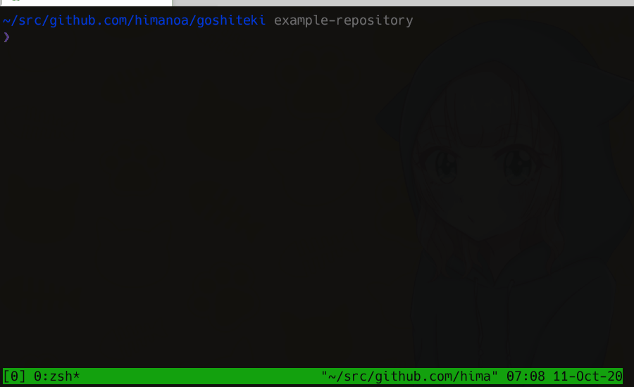

## Goshiteki

[](https://gitter.im/goshiteki/community?utm_source=badge&utm_medium=badge&utm_campaign=pr-badge)


GitHub based code review tool for neovim.



### Dependencies

- bash
- jq
- [GitHub CLI](https://github.com/cli/cli)
- [Neovim](https://github.com/neovim/neovim)

### Installation

#### For [vim-plug](https://github.com/junegunn/vim-plug)

1 Write this line
```
# your .vimrc

Plug 'himanoa/goshiteki'
```

2 Run this command
```
gh auth login
```

### Usages

1. Open the review target file for neovim
2. Execute `:GoshitekiStart` ex command.
3. Move the cursor to the place where you want to comment and execute `:GoshitekiLineComment`
4. Submit a review `:GoshitekiComment` or `GoshitekiApprove` or `GoshitekiRequestChanges`
